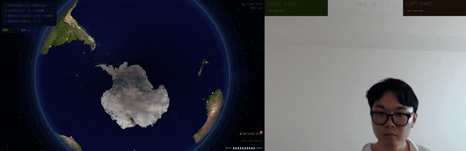

# 🌍 AI Globe Gesture Space

手のジェスチャーでリアルタイムに地球儀を操作し、都市を選択するとAIが知識を展開するインタラクティブアプリです。



## ✨ 機能

- **リアルタイム手追跡** - MediaPipe による両手検出
- **3D 地球儀** - NASAテクスチャの球面マッピング
- **ジェスチャー操作** - 払う・止まる・両手ズーム
- **AI 知識展開** - 都市を選択すると Claude が解説ノードを生成
- **シネマ演出** - 星雲・大気光・レンズフレア・フィルムグレイン
- **アンビエント BGM** - ハンスジマー風の音楽をリアルタイム合成
- **録画機能** - 地球儀＋カメラ映像を音声付きで録画

## 🎮 操作方法

| ジェスチャー | 操作 |
|---|---|
| ☝️ 右手をかざす | カーソル移動 |
| 🎯 都市の上で1.5秒静止 | AI 知識展開 |
| 💨 右手をサッと払う | 地球儀を回す |
| 🤲 両手を広げ/縮める | ズームイン/アウト |

| キー | 操作 |
|---|---|
| `R` | 地球儀＋カメラ録画（音声付き） |
| `T` | 全画面録画 |
| `M` | BGMミュート切替 |
| `↑` / `↓` | BGM音量調節 |
| `Space` | 自動回転 ON/OFF |
| `Q` / `Esc` | 終了 |

## 🛠️ セットアップ

### 必要環境
- Python 3.10+
- Webカメラ
- ANTHROPIC_API_KEY

### インストール

```bash
pip install mediapipe==0.10.9 pyautogui opencv-python pygame anthropic numpy mss sounddevice
```

### テクスチャのダウンロード

```python
import urllib.request
req = urllib.request.Request(
    "https://upload.wikimedia.org/wikipedia/commons/thumb/8/8f/Whole_world_-_land_and_oceans_12000.jpg/1280px-Whole_world_-_land_and_oceans_12000.jpg",
    headers={"User-Agent": "Mozilla/5.0"}
)
with urllib.request.urlopen(req) as r, open("world_map.jpg", "wb") as f:
    f.write(r.read())
```

### 起動

```bash
# APIキーを設定
$env:ANTHROPIC_API_KEY = "sk-ant-xxxx"

# 起動
python main.py
```

## 📁 ファイル構成

```
gestures/
├── main.py             # 起動エントリーポイント
├── gesture_engine.py   # MediaPipe 両手ジェスチャー検出
├── globe_space.py      # 3D 地球儀・AI 連携・描画
├── knowledge_space.py  # ノード空間モード
├── ambient_music.py    # アンビエント BGM 合成
├── recorder.py         # 画面・音声録画
└── world_map.jpg       # 世界地図テクスチャ（要ダウンロード）
```

## 🔧 カスタマイズ

`globe_space.py` の定数で調整できます：

```python
GLOBE_R     = 260    # 地球儀の半径
DWELL_TIME  = 1.5    # 都市選択までの秒数
MASTER_VOL  = 0.18   # BGM音量
```

## 📦 技術スタック

- [MediaPipe](https://mediapipe.dev/) - 手のランドマーク検出
- [Pygame](https://pygame.org/) - 3D レンダリング・UI
- [Claude API](https://anthropic.com/) - AI 知識生成
- [OpenCV](https://opencv.org/) - カメラ・録画
- [NumPy](https://numpy.org/) - 球面テクスチャマッピング
